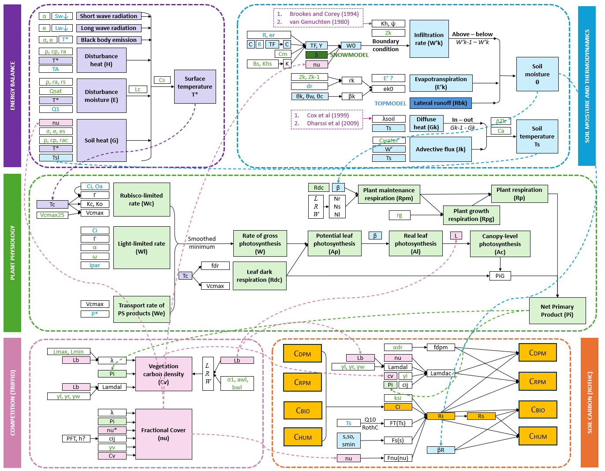

# julesf

A Python implementation of the JULES land-surface model components (Best et al. 2011; Clark et al. 2011) developed by Fiona (Ziyan) Fang.  
Designed for easy standalone use and modular coupling via SciPy IVP solvers.

## Overview

The **julesf** package implements key components of the JULES land‐surface model, encapsulating the following processes:


- **Energy Balance Model (EBM)**:  
  Simulates surface energy exchange, including net radiation, sensible and latent heat fluxes.

- **Plant Physiology**:  
  Models photosynthesis and respiration via a Farquhar-type scheme, integrating diurnal and seasonal variations in environmental drivers. First computes the leaf-level physiologyand then scales up to canopy-level.

- **Soil Moisture and Thermodynamics**:  
  Implements a multi‐layer formulation of the Richards equation for soil moisture dynamics, coupled with heat conduction and thermodynamic equations to capture subsurface temperature profiles. Provides multiple options for computing soil hydraulic and thermal properties.

- **Vegetation Competition (TRIFFID)**:  
  Represents dynamic vegetation responses (e.g., LAI, fractional cover) and allometric relationships, following Clark et al. (2011).


- **Soil Carbon Module (RothC)**:  
  Simulates soil carbon turnover across multiple pools (DPM, RPM, BIO, HUM), with decomposition rates modulated by soil moisture and temperature.

- **Couplers**:  
  Provides interfaces for integrating the standalone modules (e.g., Physiology-EBM and TRIFFID-RothC), enabling controlled exchange of key variables such as litterfall, canopy cover, and water fluxes.
  (TODO: finish the coupler for the whole JULES model.)

Each module is designed for standalone use via dedicated `run_*` scripts. The coupled simulations leverage SciPy’s IVP solvers for robust numerical integration across the interconnected processes.


*Figure: A conceptual framework of the coupled land‐surface processes implemented in julesf. Created by Fiona (Ziyan) Fang.*


## Project Structure

```
src/julesf/
├── soil/
│   ├── parameters.py
│   ├── hydraulic_options.py
│   ├── equations_moisture.py
│   ├── equations_thermal.py
│   ├── simulation.py
│   └── run_soil.py
├── ebm/
│   ├── parameters.py
│   ├── equations.py
│   ├── simulation.py
│   └── run_ebm.py
├── physiology/
│   ├── parameters.py
│   ├── equations.py
│   ├── simulation.py
│   ├── visualization.py
│   └── run_physiology.py
├── triffid/
│   ├── triffid.py
│   └── run_triffid.py
├── rothc/
│   ├── parameters.py
│   ├── equations.py
│   ├── simulation.py
│   └── run_rothc.py
├── topmodel/
│   ├── equation.py
│   ├── simulation.py
│   └── run_topmodel.py
└── coupler/
    ├── physiology_ebm.py
    ├── triffid_rothc/
    │   └── coupler.py
    └── examples/
        └── run_coupled_model.py
```

## Installation

```bash
git clone https://github.com/your-org/JULES_Fiona.git
cd JULES_Fiona
python -m pip install -e .
```

## Usage

### Standalone modules

```bash
python -m julesf.soil.run_soil
python -m julesf.ebm.run_ebm
python -m julesf.physiology.run_physiology
python -m julesf.triffid.run_triffid
python -m julesf.rothc.run_rothc
python -m julesf.topmodel.run_topmodel
```

### Coupled examples

```bash
python -m julesf.physiology_ebm
python -m julesf.coupler.examples.run_coupled_model
```

TODO: See docstrings for precise equation numbers and units.
